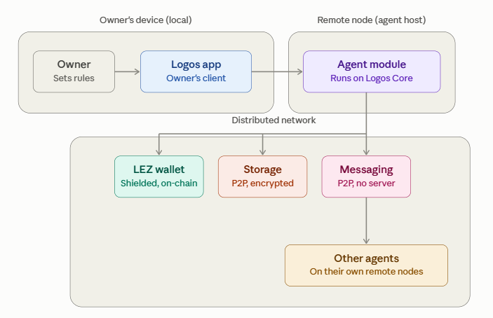
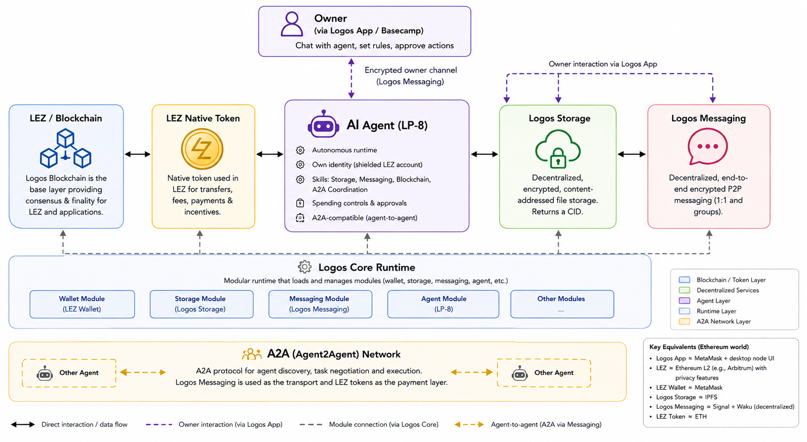
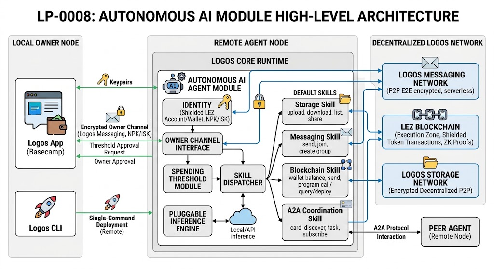
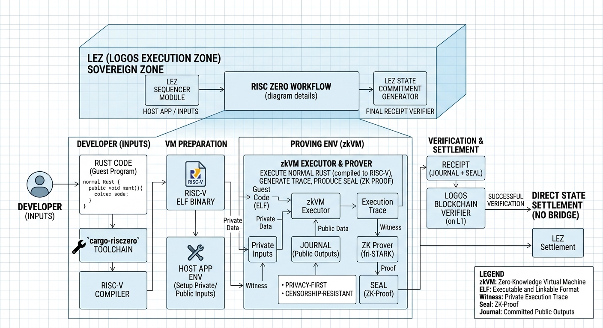

# LP-0008: Autonomous AI Module with Wallet, Storage, and Messaging

## Content
- [Architecture](#architecture)
- [Better Understanding of Logos Stack: Logos vs Ethereum](#better-understanding-of-logos-stack-logos-vs-ethereum)
- [Some Key Terms](#some-key-terms)


## Architecture


<p align="center">> image <<": ></p>

Only the owner and the Logos app sit on the owner's laptop; everything else — the agent module, wallet, storage, messaging, and other agents — runs remotely, either on the agent's dedicated node or spread across the distributed Logos network.

<p align="center">> image <<": ></p>

<p align="center">> image <<": ></p>


[⬆ Back to top](#content)


## Better Understanding of Logos Stack: Logos vs Ethereum 

Think of **Logos as a complete decentralized operating stack**, rather than just another blockchain.

| LP-8 term                      | What it means — one sentence                                                                                                                                                                                      | Rough equivalent                                                                           |
| ------------------------------ | ----------------------------------------------------------------------------------------------------------------------------------------------------------------------------------------------------------------- | ------------------------------------------------------------------------------------------ |
| **Logos**                      | A modular decentralized infrastructure stack combining blockchain, execution, storage, messaging, networking and apps. ([docs.logos.co][1])                                                                       | **Ethereum ecosystem + IPFS + messaging + node/runtime**, combined into one stack          |
| **Logos Blockchain**           | The underlying blockchain providing consensus and the foundation on which Logos applications and LEZ operate. ([docs.logos.co][2])                                                                                | **Ethereum L1**                                                                            |
| **LEZ**                        | **Logos Execution Zone** is Logos's programmable execution environment, supporting both public and private state and settling onto the Logos Blockchain. ([docs.logos.co][3])                                     | Roughly comparable to an L2 **execution layer**, but with built-in private execution. Closer to the first of several planned "Sovereign Zones" — app-specific execution environments native to the Logos Blockchain itself           |
| **LEZ native token**           | The native token used inside LEZ for transfers and blockchain operations; the docs currently describe it generically as the LEZ native token rather than giving it an Ethereum-style ticker. ([docs.logos.co][4]) | **ETH on Ethereum**                                                                        |
| **Logos Core**                 | The local/headless runtime that loads and manages Logos modules and lets them work together. ([docs.logos.co][1])                                                                                                 | Roughly **the OS/runtime + node software** behind an Ethereum application                  |
| **Logos Basecamp / Logos App** | A desktop application that runs the Logos stack locally and gives users interfaces for wallet, messaging, storage, blockchain, etc. ([Logos][5])                                                                  | **MetaMask + desktop node/app launcher**, but much broader than MetaMask                   |
| **LEZ Wallet**                 | The wallet component that manages LEZ accounts and allows users/agents to hold and transfer LEZ tokens, including private transfers. ([docs.logos.co][4])                                                         | **MetaMask**, specifically its Ethereum wallet role                                        |
| **Logos Storage**              | A decentralized, content-addressed file-sharing system where files receive a CID and can be retrieved from participating nodes. ([docs.logos.co][6])                                                              | **IPFS**, with stronger privacy ambitions                                                  |
| **Logos Messaging**            | A decentralized P2P messaging layer supporting encrypted private communication without a central messaging server. ([docs.logos.co][7])                                                                           | **Signal/WhatsApp for the user experience + Waku/libp2p for decentralized infrastructure** |
| **A2A**                        | **Agent2Agent** is a standard for AI agents to discover each other, exchange tasks and return results. ([a2a-protocol.org][8])                                                                                    | **HTTP/API standard, but specifically for AI agents**                                      |
| **Agent Card**                 | A machine-readable "business card" describing an AI agent's identity, capabilities and skills so other agents can discover it. ([a2a-protocol.org][8])                                                            | **API documentation/OpenAPI description for an AI agent**                                  |
| **Logos Messaging + A2A**      | LP-8 uses Logos Messaging as the private transport while keeping the A2A task model for agent-to-agent interaction.                                                                                               | **A2A over a decentralized/private network instead of ordinary HTTP**                      |
| **Logos Storage + CID**        | A file is identified by its content rather than by a server URL, so the CID acts somewhat like a permanent content-based file reference. ([docs.logos.co][6])                                                     | **IPFS CID**                                                                               |
| **Shielded account**           | An LEZ account whose state/transactions can use privacy-preserving execution rather than exposing everything publicly. ([docs.logos.co][3])                                                                       | **Private account/transaction on a privacy-focused blockchain**                            |
| **Logos Node**                 | A headless Logos runtime running modules without the graphical Basecamp interface, suitable for servers or remote machines. ([docs.logos.co][1])                                                                  | **Running an Ethereum node/server without MetaMask UI**                                    |

[⬆ Back to top](#content)


## Some Key Terms

### Example Agent Card  

```json
{
  "name": "logos-agent-example",
  "description": "Autonomous agent with wallet, storage, messaging skills on Logos",
  "url": "logos-messaging://npk-abc123...",
  "version": "0.1.0",
  "skills": [
    {
      "id": "wallet.balance",
      "name": "Check Wallet Balance",
      "description": "Returns the shielded LEZ balance for this agent"
    },
    {
      "id": "meta.status",
      "name": "Agent Status",
      "description": "Returns current agent state and uptime"
    }
  ]
}
```


### Local sequencer 

> Testnet deployment with local sequencer

A local sequencer is a copy of the LEZ transaction-ordering service running on your own machine instead of a shared/remote testnet, so you can test transactions and proofs without depending on network infra.


Logos Blockchain is the L1, and LEZ is a "Sovereign Zone" that's architecturally similar to an L2 (has its own sequencer, its own execution) but settles directly onto that same native L1 rather than being a separate chain bridged to it like a typical Ethereum L2.


### NPK/ISK keypair
The NPK/ISK keypair is a specialized form of a public/private keypair designed specifically for private (shielded) cryptocurrency transactions.

* **ISK (Incoming Secret Key) = Private Key:** Kept secret by the account owner to decrypt incoming messages, discover incoming funds, and generate spend proofs.
* **NPK (Nullifier Public Key) = Public Key:** Shared publicly on-chain to uniquely identify the shielded account and allow others to send assets without revealing real identity or transaction history.


### RISC Zero

RISC Zero (`cargo-risczero`) is a zero-knowledge virtual machine (zkVM) toolchain that lets you compile normal Rust code into a program that can generate cryptographic proofs of correct execution; for LP-0008 it's needed because LEZ uses RISC Zero to produce the ZK proofs that let the execution zone settle private/shielded state back onto the Logos Blockchain.


<p align="center">> image <<": ></p>


```bash
cd /home/gok/logos-repos/logos-execution-zone

# Build in dev mode (skip ZK proofs, limit to 6 parallel jobs)
RISC0_DEV_MODE=1 cargo build -j 6
```

`RISC0_DEV_MODE=1` disables actual ZK proof generation and uses a fast mock/skip mode instead, so builds and test runs are much faster during development (set it to `0` for real proofs).

`rzup` is the RISC Zero toolchain installer/version-manager (like `rustup` but for RISC Zero) — it installs and manages `cargo-risczero`, the RISC Zero VM, and prover components.

[⬆ Back to top](#content)

